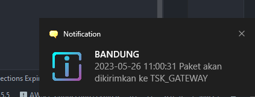
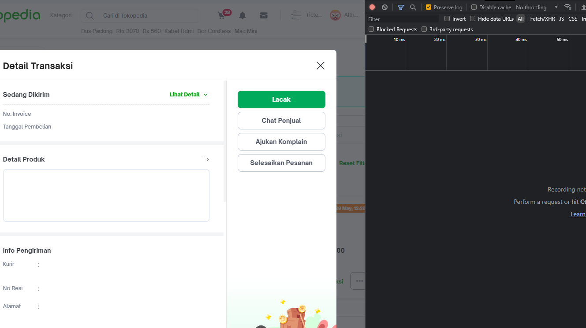
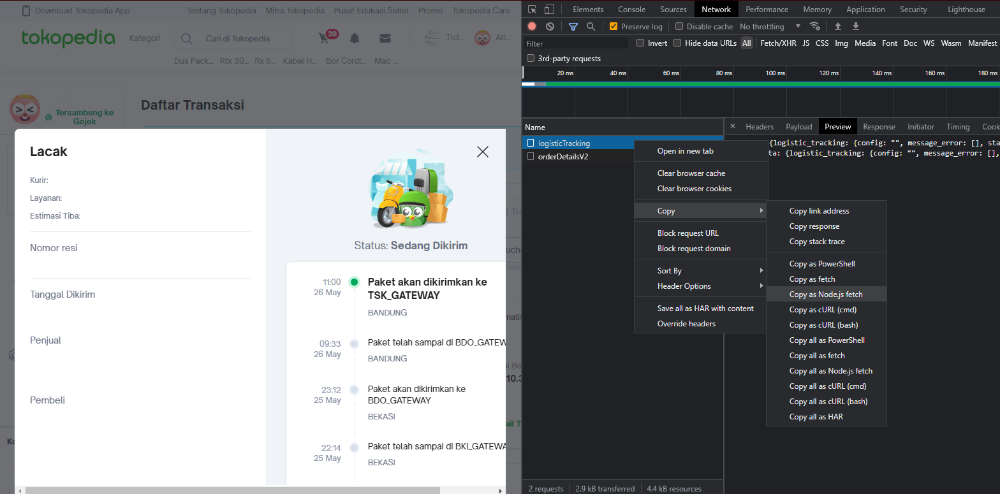
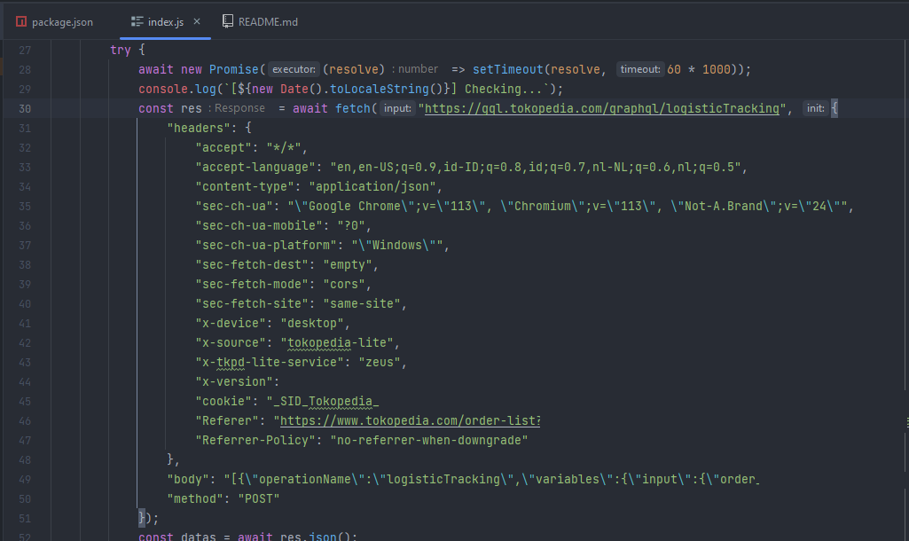

# Tokopedia Delivery Notification
Native desktop push notification for Tokopedia delivery status, automatically update every 1 minutes

## Usage
- download this repo
- replace with your own fetch
- `npm install`
- `npm start`

## How to get fetch and install your fetch

- Go to delivery status page
- Open inspect element on your browser
- Go to network tab
- Clear all request

- Click `Lacak` button
- Click on `logisticTracking` request
- Right click, `Copy`, `Copy as Node.js fetch`

- Go to `index.js` 
- Replace `fetch` so it look like this

